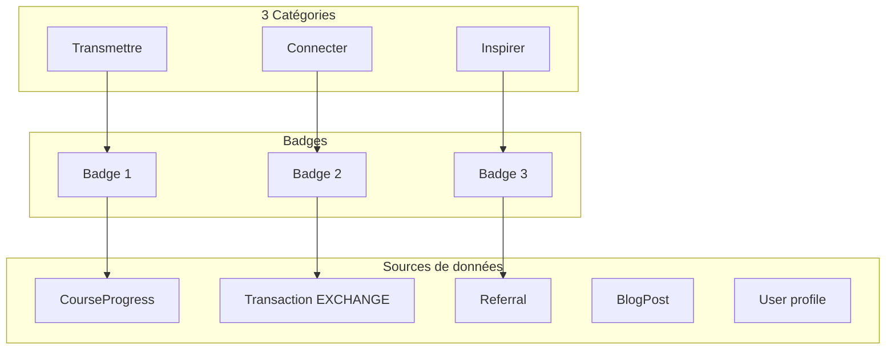
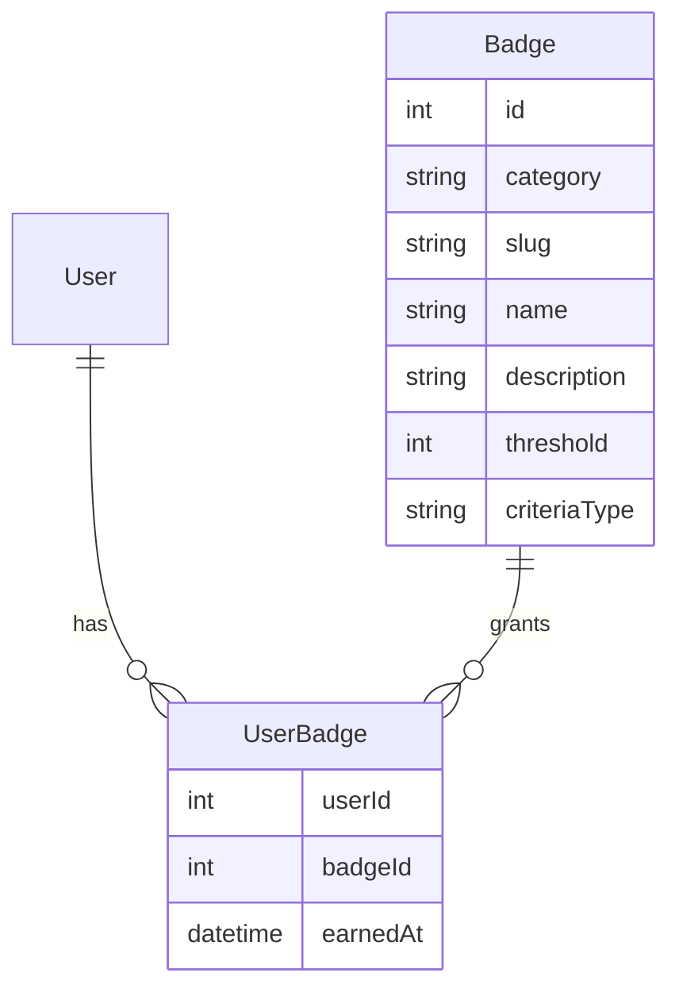

# Système de badges gamification Nuna Heritage

## Architecture proposée

---

## 1. TRANSMETTRE (savoir, contenu, partage)

### Série Academy - Terminer des contenus

| Badge                      | Condition                      | Données existantes                        |
| -------------------------- | ------------------------------ | ----------------------------------------- |
| **Gardien du Savoir**      | Termine 1 cours Academy (100%) | `CourseProgress.progressPercentage = 100` |
| **Passeur(se) de Mémoire** | Termine 5 cours                | Idem, count distinct courseId             |
| **Tāvana du Savoir**       | Termine 15 cours               | Idem                                      |
| **Maître Transmetteur**    | Termine 25 cours               | Idem                                      |

### Série Blog collaboratif - Articles validés

| Badge                      | Condition                        | Données / Évolution                   |
| -------------------------- | -------------------------------- | ------------------------------------- |
| **Pigiste**                | 1 article validé (status ACTIVE) | `BlogPost` : authorId + status=ACTIVE |
| **Rédacteur / Rédactrice** | 3 articles validés               | Idem                                  |
| **Journaliste**            | 10 articles validés              | Idem                                  |
| **Rédacteur en Chef**      | 25 articles validés              | Idem                                  |

*Note : Le blog a déjà `authorId` et `status`. Il faut ajouter un workflow de validation admin (draft → soumis → active) si pas déjà en place.*

### Série Culture - Consultation de contenus

| Badge                      | Condition                   | Données à créer                                             |
| -------------------------- | --------------------------- | ----------------------------------------------------------- |
| **Archiviste**             | Consulte 5 contenus Culture | Nouvelle entité `CultureView` (userId, cultureId, viewedAt) |
| **Curateur du Patrimoine** | Consulte 20 contenus        | Idem                                                        |
| **Gardien des Mémoires**   | Consulte 50 contenus        | Idem                                                        |

### Série Academy - Création de formations (future)

| Badge                           | Condition                  | Données à créer                            |
| ------------------------------- | -------------------------- | ------------------------------------------ |
| **Formateur émergent**          | Publie 1 formation validée | `Course.createdById` + workflow validation |
| **Enseignant de la Communauté** | Publie 3 formations        | Idem                                       |
| **Maître Formateur**            | Publie 5 formations        | Idem                                       |

---

## 2. CONNECTER (réseau, échanges, communauté)

### Série Profil

| Badge            | Condition           | Données existantes                                                 |
| ---------------- | ------------------- | ------------------------------------------------------------------ |
| **Premier Lien** | Complète son profil | `useProfileValidation` : firstName, lastName, commune, phoneNumber |

### Série Troc (Nuna'a Troc)

| Badge                         | Condition         | Données existantes                                                           |
| ----------------------------- | ----------------- | ---------------------------------------------------------------------------- |
| **Premier Troc**              | Réussit 1 échange | `Transaction` type=EXCHANGE, status=COMPLETED, user = fromUserId OU toUserId |
| **Tāvana du Troc**            | 5 trocs           | Idem                                                                         |
| **Fa'a'apu de la Communauté** | 15 trocs          | Idem                                                                         |
| **Ra'atira du Troc**          | 50 trocs          | Idem                                                                         |
| **Maître Troqueur**           | 100 trocs         | Idem                                                                         |

*Ra'atira = chef, maître (tahitien) — niveau intermédiaire entre Fa'a'apu et Maître Troqueur.*

### Série Parrainage

| Badge                          | Condition                | Données existantes                      |
| ------------------------------ | ------------------------ | --------------------------------------- |
| **Ambassadeur / Ambassadrice** | Parraine 1 membre validé | `Referral` : referrerId, status=VALIDEE |
| **Rameur de la Communauté**    | Parraine 5 membres       | Idem                                    |
| **Navigateur du Réseau**       | Parraine 15 membres      | Idem                                    |

### Série Soutien

| Badge             | Condition                      | Données à créer                                                       |
| ----------------- | ------------------------------ | --------------------------------------------------------------------- |
| **Soutien Local** | 1 achat chez un partenaire     | Entité `PartnerPurchase` (userId, partnerId, purchasedAt, montant?)   |
| **Mécène**        | 5 achats chez des partenaires  | Idem                                                                  |
| **Bienfaiteur**   | 15 achats chez des partenaires | Idem                                                                  |

*Note : Les partenaires sont listés dans `partners`. Il faut un flux de déclaration/validation des achats (formulaire utilisateur + validation admin, ou lien partenaire avec tracking).*

---

## 3. INSPIRER (engagement, événements, soutien)

### Série Te Natira'a

| Badge                        | Condition        | Données à créer                                               |
| ---------------------------- | ---------------- | ------------------------------------------------------------- |
| **Présence au Natira'a**     | Participe 1 fois | Entité `EventParticipation` (userId, eventId, participatedAt) |
| **Habitué du Rassemblement** | Participe 2 fois | Idem                                                          |
| **Pilier du Natira'a**       | Participe 3 fois | Idem                                                          |
| **Gardien du Rassemblement** | Participe 5 fois | Idem                                                          |

### Série Témoignages

| Badge                     | Condition                  | Données à créer                                 |
| ------------------------- | -------------------------- | ----------------------------------------------- |
| **Voix de la Communauté** | Laisse 1 témoignage validé | Entité `Testimonial` (userId, videoUrl, status) |
| **Porte-parole**          | 3 témoignages validés      | Idem                                            |
| **Conteur Public**        | 5 témoignages validés      | Idem                                            |

### Série Découverte (implémentée)

Trois **univers métier** (pas des URLs) : **Transmettre**, **Connecter**, **Inspirer**. Pour chaque univers, on compte combien de **types** d’actions distincts sont remplis (0 à 3), puis on applique les paliers.

**Transmettre** : cours Academy terminé (≥99,99 %) **ou** ≥1 article blog validé (`ACTIVE`) **ou** `formateurPoints` ≥ 1.

**Connecter** : ≥1 troc / transfert Pūpū compté (comme série Troc) **ou** ≥1 ligne `Referral` en tant que parrain (tout statut) **ou** `tenatiraaPresencePoints` ≥ 1.

**Inspirer** : ≥1 consultation Culture **ou** ≥1 témoignage vidéo approuvé **ou** ≥1 réponse sondage (`poll_responses.userId`).

| Code badge                         | Nom affichage (FR)           | Condition                                                                 |
| ---------------------------------- | ---------------------------- | ------------------------------------------------------------------------- |
| `discovery_first_step`             | Éclaireur                    | t + c + i ≥ 1 (1 action sur le site)                                      |
| `discovery_three_universes_one_each` | Explorateur               | min(t, c, i) ≥ 1 (1 type d’action / univers)                               |
| `discovery_five_action_types`      | Passeur d’horizons           | min(t, c, i) ≥ 2 (2 types / univers ; max 3 par univers)                    |
| `discovery_two_each_universe`        | Architecte des trois mondes  | min(t, c, i) ≥ 3 (tous les types dans chaque univers)                      |

Logique : [`badges.service.ts`](../backend/src/badges/badges.service.ts) (`getDiscoveryUniverseCounts`, `syncDiscoveryBadges`). Pas de table dédiée « visites par zone » pour cette série.

---

## 4. BADGES SPÉCIAUX (hors catégories)

Critères **indépendants** (pas une série à paliers). Codes : `special_*` dans [`badges.service.ts`](../backend/src/badges/badges.service.ts) (`syncSpecialBadges`).

| Badge                      | Condition                                                 | Implémentation                                               |
| -------------------------- | --------------------------------------------------------- | ------------------------------------------------------------ |
| **Membre Fondateur 2026**  | Inscription avant le 11 avril 2026                        | `User.createdAt < 2026-04-11T00:00:00.000Z`                  |
| **Pionnier du Troc**       | 1 troc complété avant le 1er mai 2026                     | `Transaction` EXCHANGE ou DEBIT complété, `createdAt` avant cutoff mai 2026 |
| **Collectionneur de Pūpū** | 500 Pūpū en portefeuille                                  | `User.walletBalance >= 500`                                  |
| **VIP Heritage**           | Rôle VIP                                                  | `User.role = 'vip'`                                          |
| **Toa de la Communauté**   | Plus de 40 autres badges (hors ce badge)                  | `COUNT(user_badges WHERE badgeCode != 'special_toa_community') > 40` |
| **10 / 20 badges**        | 10 puis 20 badges obtenus (hors paliers « total »)        | `special_badges_total_10`, `special_badges_total_20`                       |
| **Respect des anciens**   | 75+ ans, attribution admin                                | `users.respectAnciensBadgeGranted` → `special_respect_anciens`             |

---

## Modèle de données à créer

### Entités minimales pour le système de badges

### Entités pour les critères manquants

| Entité               | Champs                                                                | Usage                            |
| -------------------- | --------------------------------------------------------------------- | -------------------------------- |
| `Badge`              | id, category, slug, name, description, criteriaType, threshold, order | Définition des badges            |
| `UserBadge`          | userId, badgeId, earnedAt                                             | Badges obtenus par l'utilisateur |
| `CultureView`        | userId, cultureId, viewedAt                                           | Consultation Culture             |
| `EventParticipation` | userId, eventId, participatedAt                                       | Participation Te Natira'a        |
| `Testimonial`        | userId, videoUrl, status, validatedAt                                 | Témoignages vidéo                |
| `PartnerPurchase`    | userId, partnerId, purchasedAt, amount?, status (pending/validated) | Achats chez partenaires          |
| `Event` (optionnel)  | id, name, date                                                        | Événements Te Natira'a           |

---

## Récapitulatif des sources de données

| Source                          | Existe | Fichier / entité                                                            |
| ------------------------------- | ------ | --------------------------------------------------------------------------- |
| CourseProgress (cours terminés) | Oui    | [course-progress.entity.ts](backend/src/entities/course-progress.entity.ts) |
| Transaction EXCHANGE (trocs)    | Oui    | [transaction.entity.ts](backend/src/entities/transaction.entity.ts)         |
| Referral VALIDEE (parrainages)  | Oui    | [referral.entity.ts](backend/src/entities/referral.entity.ts)               |
| BlogPost ACTIVE (articles)      | Oui    | [blog-post.entity.ts](backend/src/entities/blog-post.entity.ts)             |
| Profil complet                  | Oui    | [useProfileValidation.ts](frontend/app/composables/useProfileValidation.ts) |
| CultureView                     | Non    | À créer                                                                     |
| EventParticipation              | Non    | À créer                                                                     |
| Testimonial                     | Non    | À créer                                                                     |
| PartnerPurchase                 | Non    | À créer (achats chez partenaires)                                          |
| UserActivity (univers)          | N/A    | Série Découverte : dérivée des entités existantes + `PollResponse`          |

---

## Recommandations

1. **Phase 1** : Badges basés sur les données existantes (Academy, Troc, Parrainage, Profil, Blog).
2. **Phase 2** : Ajout de `CultureView`, `EventParticipation`, `Testimonial` pour les badges Inspirer.
3. **Phase 3** : Badges "Éclaireur" et "Soutien" selon la priorité métier.
4. **Blog collaboratif** : Vérifier le workflow draft → soumis → active et l'attribution à l'auteur.
5. **Te Natira'a** : Créer un flux d'inscription/participation (formulaire ou QR) pour alimenter `EventParticipation`.

---

## Noms alternatifs (style polynésien)

- **Tāvana** = chef, leader (tahitien)
- **Ra'atira** = chef, maître (tahitien)
- **Fa'a'apu** = jardin, culture (fa'a'apu = cultiver)
- **Toa** = guerrier, héros
- **Pūpū** = coquillage (déjà utilisé pour la monnaie)
- **Te Natira'a** = le rassemblement
- **Rameur** = rameur (va'a, pirogue)
- **Navigateur** = explorateur polynésien

Ces termes peuvent être réutilisés pour personnaliser d'autres noms de badges selon le ton souhaité.
